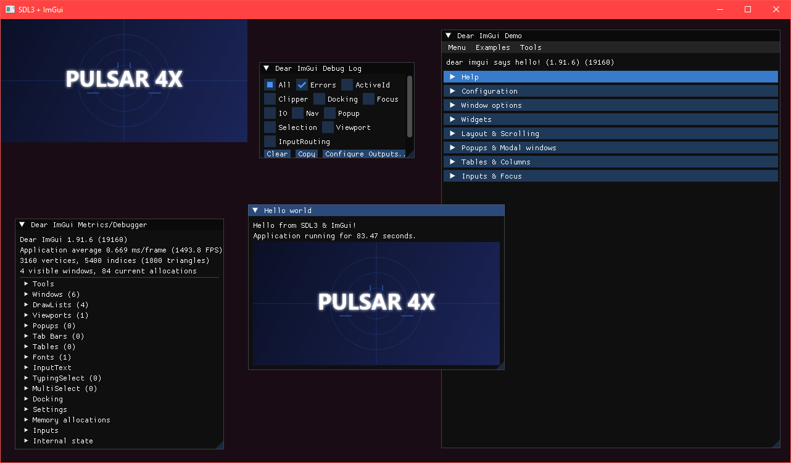

# SDL3-ImGui

A C# implementation of SDL3 + ImGui using the SDL3 renderer backend.

## Links

- [ImGui.NET](https://github.com/ImGuiNET/ImGui.NET)
- [SDL3-CS](https://github.com/edwardgushchin/SDL3-CS)
- [Pulsar4x](https://github.com/Pulsar4xDevs/Pulsar4x)

